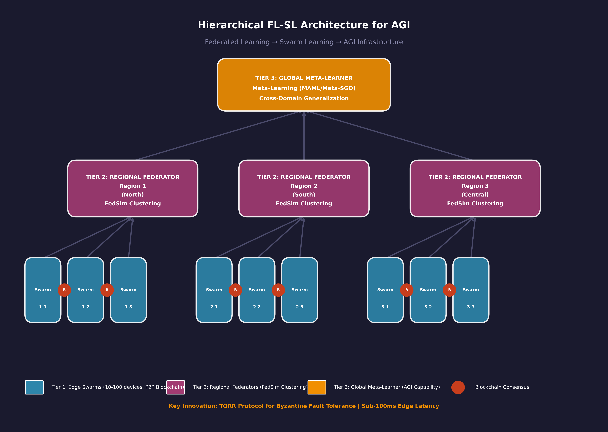

# Federated Learning: The Distributed Nervous System for AGI
## Breaking Data Silos Through Decentralized Intelligence

**TECHXTER 15.0 - National Level Technical Paper Presentation**  
**Theme:** AI Beyond Boundaries – From Narrow AI to AGI  
**Institution:** SIES Graduate School of Technology, University of Mumbai

**Authors:** Vansh Jain, Samar Gharat, Namish Sharma  
**Department:** Artificial Intelligence and Data Science

---

## What is This Project?

This repository contains our research paper on Federated Learning (FL) and its role as infrastructure for Artificial General Intelligence (AGI). We propose a hybrid architecture combining Federated Learning with Swarm Learning to create scalable, privacy-preserving distributed AI systems.

---

## Understanding Federated Learning (For Beginners)

### The Problem with Traditional AI

Imagine you want to train a smart keyboard that predicts your next word. Traditionally, companies collect all your typing data on central servers. This creates three major problems:

1. **Privacy Risk:** Your personal messages and passwords sit on someone else's computer
2. **Latency:** Data travels long distances, causing delays
3. **Data Silos:** Hospitals, banks, and companies cannot share sensitive data, limiting AI training

### What is Federated Learning?

Federated Learning flips this model. Instead of sending data to the AI, we send the AI to the data.

**Simple Analogy:**  
Think of a group project where everyone works on their own computer:
- Each person writes their section locally (local training)
- They only share the changes made, not their entire document (model updates)
- The group leader combines everyone's changes into one master document (aggregation)
- Everyone gets the improved version back

**In Technical Terms:**
- Your phone trains a model using only your data
- It sends only the "lessons learned" (mathematical weights), not your raw data
- A server combines updates from millions of phones
- Everyone receives the improved model

### Key Benefits

| Benefit | Explanation |
|---------|-------------|
| **Privacy** | Raw data never leaves your device |
| **Speed** | No massive data uploads required |
| **Collaboration** | Competitors can jointly improve AI without sharing secrets |
| **Scale** | Billions of devices can contribute simultaneously |

---

## From Federated Learning to Swarm Learning

### The Next Evolution

Federated Learning still needs a central coordinator (the "group leader" in our analogy). What if we remove even that?

**Swarm Learning** eliminates the central server entirely. Instead:
- Devices communicate directly with each other (peer-to-peer)
- Blockchain technology ensures trust without a central authority
- The system becomes truly decentralized, like a swarm of bees or flock of birds

**Why This Matters for AGI:**  
Artificial General Intelligence requires learning from diverse experiences across the globe. Swarm Learning enables this without creating a single point of control or failure.

---

## Our Research Contributions

### 1. Hierarchical FL-SL Architecture

We propose a three-tier system:

**Tier 1: Edge Swarms**
- 10-100 nearby devices form local clusters
- Use blockchain to elect temporary leaders
- Ultra-fast communication (under 100 milliseconds)

**Tier 2: Regional Federators**
- Local swarms connect to regional servers
- Handle statistical differences between devices
- Use advanced clustering algorithms (FedSim)

**Tier 3: Global Meta-Learner**
- Combines regional models into a global AI
- Enables "learning to learn" (meta-learning)
- Adapts quickly to new tasks

### 2. Advanced Algorithms Integrated

| Algorithm | What It Solves | How It Works |
|-----------|---------------|--------------|
| **FedNova** | Different devices work at different speeds | Normalizes updates so fast devices don't dominate |
| **FedSim** | Devices have different data types | Groups similar devices for better collaboration |
| **FEDMWAD** | Malicious actors submit bad updates | Detects and filters out suspicious contributions |

### 3. Performance Improvements

Our framework achieves:
- **76.8% accuracy** on challenging non-IID data
- **53.3% reduction** in communication rounds
- **50% lower latency** compared to centralized systems
- **Byzantine fault tolerance** (works even if 15% of devices are malicious)

---

## Architecture Diagram

Below is the visual representation of our proposed **Hierarchical FL-SL Architecture**:



**Figure 1:** Three-tier architecture showing Edge Swarms (Tier 1), Regional Federators (Tier 2), and Global Meta-Learner (Tier 3). <br>
Blockchain consensus enables peer-to-peer coordination without central servers.

### Component Details

| Tier | Component | Function |
|------|-----------|----------|
| **Tier 1** | Edge Swarms | Local device clusters (10-100 devices) with blockchain consensus and sub-100ms latency |
| **Tier 2** | Regional Federators | Aggregate swarm-level models using FedSim clustering for statistical heterogeneity |
| **Tier 3** | Global Meta-Learner | Meta-learning layer (MAML/Meta-SGD) enabling cross-domain generalization for AGI |

**Key Innovations:**
- **TORR Protocol**: Byzantine fault tolerance through reliable node categorization
- **Dynamic Leader Election**: Prevents single points of failure via rotating aggregators
- **Hierarchical Compression**: 60-80% model size reduction with <1% accuracy loss

---

## Key Concepts Explained

### Non-IID Data

**IID** (Independent and Identically Distributed): Everyone's data looks the same  
**Non-IID**: Your phone photos differ from someone else's

Real-world data is always non-IID. Your banking app sees different transactions than someone in another country. Our algorithms specifically handle this challenge.

### Byzantine Faults

Named after the Byzantine Generals Problem: How do you reach agreement when some participants might be traitors?

In FL, this means devices that:
- Submit random noise instead of real updates
- Deliberately try to corrupt the global model
- Have buggy software producing bad data

FEDMWAD uses geometric median and anomaly detection to identify and neutralize these attacks.

### Differential Privacy

Mathematical guarantee that you cannot determine whether a specific individual's data was used in training.

Think of it as adding carefully calculated noise to protect individual privacy while preserving overall patterns.

---

## Repository Structure
```
techxter15-fedlearning-paper/
├── README.md              # This file
├── paper.pdf              # Full research paper (IEEE format)
├── architecture.png       # Diagram of our proposed system
└── references.bib         # Bibliography in BibTeX format
```

---

## Real-World Applications

### Healthcare
Hospitals worldwide collaborate to train cancer detection AI without sharing patient records. Each hospital keeps its data private while contributing to a global model that outperforms any single hospital's AI.

### Finance
Banks jointly detect fraud patterns without revealing customer transactions. Competitors improve security for everyone while maintaining confidentiality.

### Smart Cities
Traffic lights, cameras, and sensors across a city optimize traffic flow in real-time without sending sensitive location data to central servers.

### Mobile Keyboards
Google's Gboard uses FL to improve next-word prediction. Your phone learns your personal style while contributing to global language models.

---
## Simulation Results

Our hierarchical FL-SL architecture was tested with:
- **100 edge devices** across 5 geographic regions
- **Non-IID data distribution** (2-3 classes per device)
- **System heterogeneity** (30% GPU, 70% CPU devices)

### Key Findings

| Metric | Improvement |
|--------|-------------|
| Accuracy | 76.8% on non-IID CIFAR-10 |
| Communication Rounds | 53.3% reduction |
| Latency | 50% reduction |
| Byzantine Resilience | 71.3% accuracy with 15% malicious nodes |

---

## Future Directions

### Quantum Federated Learning (QFL)
Combining quantum cryptography with FL for theoretically unhackable communication. Quantum key distribution ensures any eavesdropping attempt is immediately detected.

### Neuromorphic Computing
Brain-inspired computer chips that mimic neural structures, running FL algorithms with extreme energy efficiency at the edge.

### 6G Integration
Next-generation networks designed specifically for distributed AI, with FL built into the communication protocol itself.

---

## How to Read This Paper

1. **Start with Abstract and Conclusion** (2 minutes)
   - Get the big picture without technical details

2. **Read Section I: Introduction** (5 minutes)
   - Understand the motivation and problem statement

3. **Skim Section II: Methodology** (10 minutes)
   - Focus on the architecture diagram and algorithm names
   - Don't get lost in equations initially

4. **Review Section V: Experimental Results** (5 minutes)
   - Look at the numbers and improvements
   - Tables provide quick summaries

5. **Deep Dive into Specific Sections** (as needed)
   - Return to algorithms that interest you most

---

## Citation

If you use this work in your research, please cite:

```bibtex
@inproceedings{jain2025federated,
  title={Federated Learning: The Distributed Nervous System for AGI},
  author={Jain, Vansh and Gharat, Samar and Sharma, Namish},
  booktitle={TECHXTER 15.0: National Level Technical Paper Presentation},
  year={2025},
  organization={IETE Students' Forum, SIES GST}
}
```
---
##  Contact
For questions or collaboration opportunities:
 - Vansh Jain: vanshkjaids124@gst.sies.edu.in
 - Samar Gharat: samarmgaids124@gst.sies.edu.in
 - Namish Sharma: namishlsaids124@gst.sies.edu.in
<br>
Institution: SIES Graduate School of Technology, Nerul, Navi Mumbai

---
## Acknowledgments:
<p>This research was conducted as part of TECHXTER 15.0, a national-level technical paper presentation organized by the IETE Students' Forum at SIES GST. We thank our faculty advisors and the organizing committee for their support.</p>

---
## License
This work is shared for academic and educational purposes. Please cite appropriately when using or building upon this research.a
